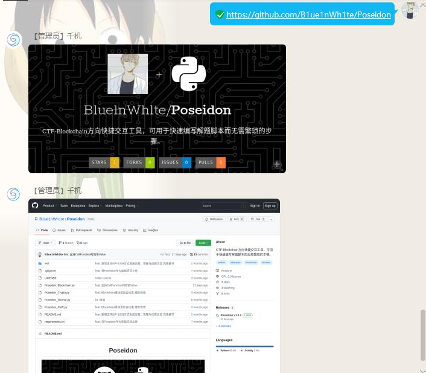
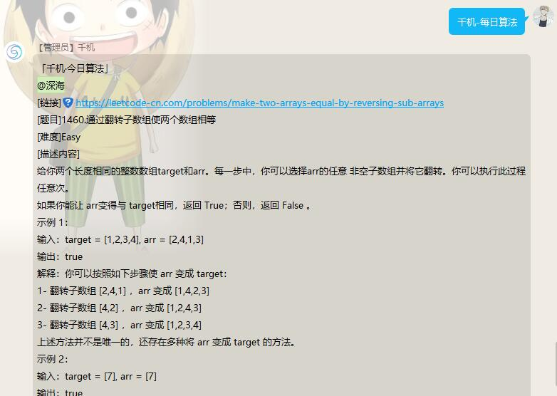
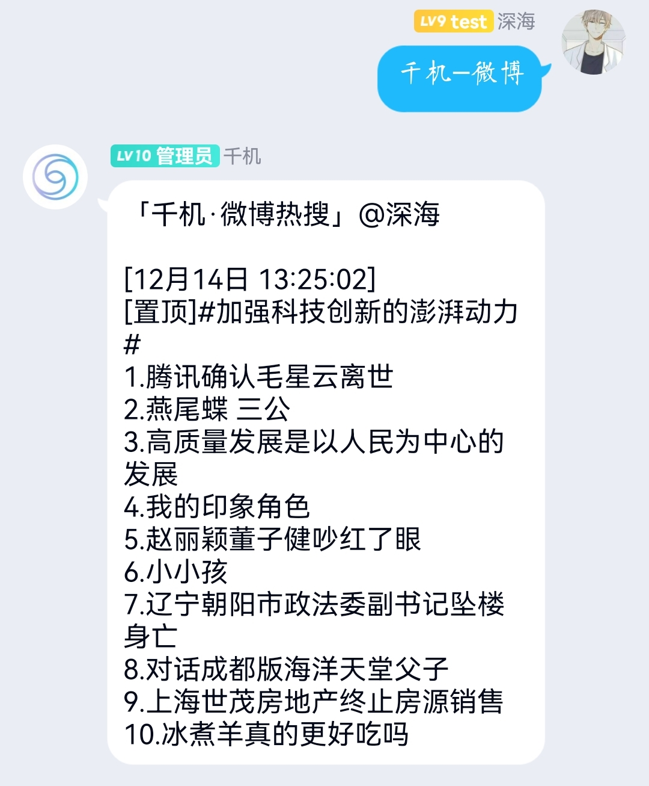
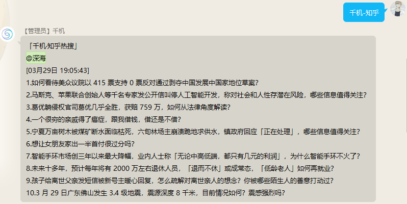
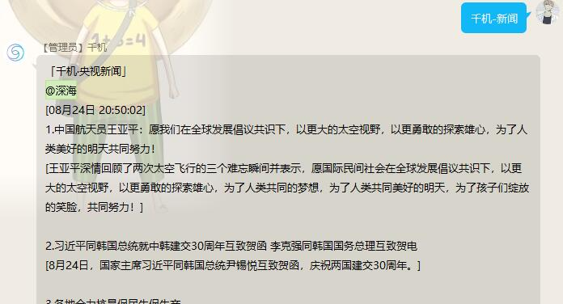
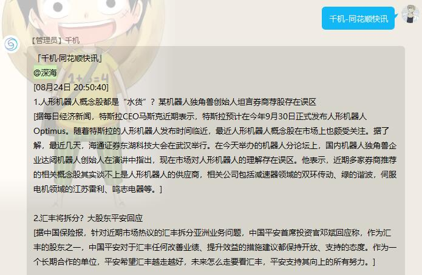
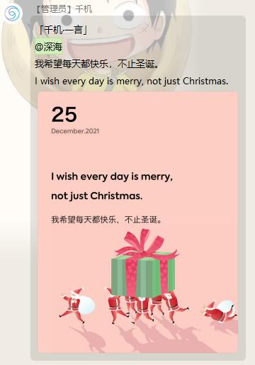

<div align="center">

# SeaBot_QQ


SeaBot_QQ 是一个面向新闻资讯方向的 QQ 群聊机器人，同时包含其他一些实用的小功能

[](https://github.com/B1ue1nWh1te/SeaBot_QQ/blob/main/LICENSE)
[](https://github.com/B1ue1nWh1te/SeaBot_QQ/releases/)
[](https://www.python.org/)
[](https://github.com/nonebot/nonebot2)
[](https://github.com/Mrs4s/go-cqhttp)
[](https://github.com/B1ue1nWh1te/SeaBot_QQ)

</div>

# 前言

此项目作为个人日常使用，由于只在自己的班群里使用，所以功能不是很多，若有不足的地方请提出。

# 功能列表

- [x] [定时提醒](seabot/plugins/timed_reminder)
- [x] [Github 仓库摘要图](seabot/plugins/github_reposity_thumbnail)
- [x] [Leetcode 每日一题](seabot/plugins/leetcode_daily)
- [x] [微博热搜](seabot/plugins/hot_news)
- [x] [知乎热榜](seabot/plugins/hot_news)
- [x] [央视要闻](seabot/plugins/hot_news)
- [x] [同花顺快讯](seabot/plugins/hot_news)
- [x] [一言](seabot/plugins/one_saying)

# 部署方法

## 容器化部署

在 Linux 服务器上部署，首先安装 docker 和 docker-compose:

```shell
# 一键安装docker
curl -fsSL https://get.docker.com | bash -s docker --mirror Aliyun

# 查看docker版本
docker -v

# 设置开机启动
systemctl enable docker

# 启动
systemctl start docker

# 安装docker-compose
pip3 install docker-compose

# 查看docker-compose版本
docker-compose --version
```

之后克隆本仓库：

```shell
# 克隆本仓库
git clone https://github.com/B1ue1nWh1te/SeaBot_QQ

# 切换至仓库目录
cd SeaBot_QQ
```

然后按自己的需求修改`seabot/plugins`中各个功能插件的`config.py`中的配置参数。

再修改 `./go-cqhttp` 中的 `config.yml` 配置文件，一般情况下，在 `account-uin` 字段中填写机器人的 QQ 号即可，如遇到特殊情况如无法登录，可以尝试将到[go-cqhttp](https://github.com/Mrs4s/go-cqhttp)仓库下载最新的`Windows`版本`exe`文件至本地，填写好配置后先在本地登录机器人账号，获取到`device.json`和`session.token`文件后再上传至服务器使用。

最后修改 `./` 中的 `.env.prod` 配置文件，一般情况下，修改机器人昵称和超级管理员账户即可。

也可以直接按照[deploy](deploy/)文件夹进行修改配置和启动容器。

配置修改完成后，在 `SeaBot_QQ` 目录下打开终端，执行如下命令一键启动容器。

```shell
# 一键启动容器
docker-compose up -d
```

等待容器自动部署即可。

```shell
# 查看go-cqhttp容器控制台输出
docker logs -f go-cqhttp

# 查看seabot_qq容器控制台输出
docker logs -f seabot_qq
```

如果日志输出正常则表明机器人运行成功。

# 文档

如果在使用过程中遇到问题可以提[issue](https://github.com/B1ue1nWh1te/SeaBot_QQ/issues)，或者查阅以下官方文档。

- [nonebot2 官方文档](https://v2.nonebot.dev/guide/)

- [go-cqhttp 官方文档](https://docs.go-cqhttp.org/guide/)

# 功能调用示例

图片中的内容是通过 API 获取的外部信息，仅作功能展示示例。

我们假设机器人昵称为 `千机` 。

> Github 仓库摘要 | `直接发送仓库链接到群内即可`



<br>

> 力扣每日一题 | `千机-每日算法`



<br>

> 微博热搜 | `千机-微博`



<br>

> 知乎热榜 | `千机-知乎`



<br>

> 央视要闻 | `千机-新闻`



<br>

> 同花顺快讯 | `千机-同花顺快讯`



<br>

> 一言 | `千机-一言`



<br>

# 开源许可

本项目使用 [GPL-3.0](https://choosealicense.com/licenses/gpl-3.0/) 作为开源许可证。
