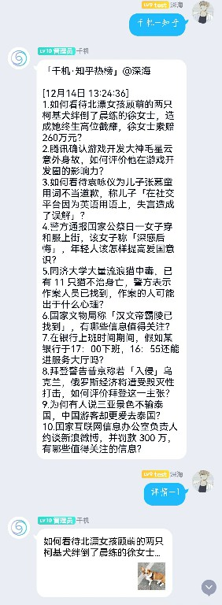

<div align="center">

# SeaBot_QQ


SeaBot 计划的 QQ 分支

一个能够获取新闻资讯并推送至 QQ 的群聊机器人

主体基于 [nonebot2](https://github.com/nonebot/nonebot2) 开发

消息推送基于 [go-cqhttp](https://github.com/Mrs4s/go-cqhttp) 实现

本项目的另一分支 [SeaBot_WX](https://github.com/B1ue1nWh1te/SeaBot_WX)

[](https://github.com/B1ue1nWh1te/SeaBot_QQ/blob/main/LICENSE)
[](https://github.com/B1ue1nWh1te/SeaBot_QQ/releases/)
[](https://www.python.org/)
[](https://github.com/nonebot/nonebot2)
[](https://github.com/Mrs4s/go-cqhttp)

</div>

# 声明

项目会保留最基本的维护(功能也许会更新吧，由于只在自己的班群里使用，所以目前实现的也没有太花里胡哨- -)，若有不足的地方还请指教。

此项目仅可在合理情况下作为学习交流和个人日常使用。

# 已实现功能

- [x] [Call 回复](https://github.com/B1ue1nWh1te/SeaBot_QQ/tree/main/src/plugins/chat)(就是机器人昵称被 Call 时进行简单的回复)

- [x] [定时打卡提醒](https://github.com/B1ue1nWh1te/SeaBot_QQ/tree/main/src/plugins/clockin)(超级管理员可主动调用)

- [x] [力扣每日一题](https://leetcode-cn.com/problemset/all/)

- [x] [Github 仓库信息卡片](https://github.com/)(当机器人接收到一个 Github 仓库链接时 会自动发送信息卡片)

- [x] [知乎热榜推送](https://github.com/B1ue1nWh1te/SeaBot_QQ/tree/main/src/plugins/news)(默认仅展示前十条的标题)

- [x] [微博热搜推送](https://github.com/B1ue1nWh1te/SeaBot_QQ/tree/main/src/plugins/news)(默认仅展示前十条的标题)

- [x] [央视新闻推送](https://github.com/B1ue1nWh1te/SeaBot_QQ/tree/main/src/plugins/news)(默认展示前五条的标题及详情内容)

- [x] [同花顺快讯推送](https://github.com/B1ue1nWh1te/SeaBot_QQ/tree/main/src/plugins/news)(默认展示前五条的标题及详情内容)

- [x] [历史上的今天推送](https://github.com/B1ue1nWh1te/SeaBot_QQ/tree/main/src/plugins/todaybefore)(数据来源本质上是百度的历史上的今天)

- [x] [疫情数据推送](https://wp.m.163.com/163/page/news/virus_report/index.html)(数据来源 网易)

- [x] [天气和每日一句](#)

- [x] [HNU 电费查询](https://www.hnu.edu.cn/)

- [x] [部分功能可定时](https://github.com/B1ue1nWh1te/SeaBot_QQ/tree/main/src/plugins)(推送时间和次数可自行配置)

# 部署

## 容器化部署

使用容器化部署可以让你非常快速地把机器人服务跑起来(一顿操作 调调配置就可以直接用了)。

CentOS 下安装 docker 和 docker-compose:

```shell
# 一键安装docker
curl -fsSL https://get.docker.com | bash -s docker --mirror Aliyun

# 查看docker版本
docker -v

# 设置开机启动
systemctl enable docker

# 启动
systemctl start docker


# 安装docker-compose
pip3 install docker-compose

# 国内加速
# sudo curl -L "https://github.com.cnpmjs.org/docker/compose/releases/download/v2.2.2/docker-compose-linux-x86_64" -o /usr/local/bin/docker-compose
sudo curl -L "https://github.com/docker/compose/releases/download/v2.2.2/docker-compose-linux-x86_64" -o /usr/local/bin/docker-compose

# 二进制文件应用可执行权限
sudo chmod +x /usr/local/bin/docker-compose

# 创建命令软链接
ln -s /usr/local/bin/docker-compose /usr/bin/docker-compose

# 查看docker-compose版本
docker-compose --version
```

假设你已经在 Linux 上安装并配置好了 docker 和 docker-compose。

```shell
# 克隆本仓库
# 国内加速 git clone https://github.com.cnpmjs.org/B1ue1nWh1te/SeaBot_QQ
git clone https://github.com/B1ue1nWh1te/SeaBot_QQ

# 切换至仓库目录
cd SeaBot_QQ
```

修改`src/plugins`中各功能插件的`config.py`配置。

之后修改 `./go-cqhttp` 中的 `config.yml` 配置文件，一般情况下，在 `account-uin` 字段中填写机器人的 QQ 号，其他保持默认即可。

然后修改 `./` 中的 `.env.prod` 配置文件，一般情况下，修改 `NICKNAME`、`SUPERUSERS`、`GROUP_ID`, 其他保持默认即可。

两项配置修改完成后，在 `SeaBot_QQ` 目录下打开终端，执行如下命令。

```shell
# 容器服务编排
docker-compose up -d
```

等待应用自动部署即可。

初次使用时，需要在 `go-cqhttp` 端扫码登录机器人账号，可使用如下命令查看并扫码。

```shell
# 查看go-cqhttp容器控制台输出
docker logs -f go-cqhttp

# 查看seabot_qq容器控制台输出
docker logs -f seabot_qq
```

一切顺利的话，很快就可以用上机器人了。

# 文档

以下文档可以参考。

- [nonebot2 官方文档](https://v2.nonebot.dev/guide/)

- [go-cqhttp 官方文档](https://docs.go-cqhttp.org/guide/)

# 功能调用示例

声明：消息内容为通过 API 获取的信息，仅做功能展示示例，不代表任何政治立场观点。

我们假设机器人昵称为 `千机` 。

- Call 回复 | `千机`

  - 

- 知乎热榜 | `千机-知乎`

  - 若在一定时间内回复 `详情-1` 机器人会分享对应的链接
  - 或 `千机-知乎 1,2` 这样就会直接分享对应的链接

  - 
  - 

- 微博热搜 | `千机-微博`

  - 

* 央视新闻 | `千机-央视新闻`

  - 

* 同花顺快讯 | `千机-同花顺`

  - 

* Github 仓库摘要 | `直接发送仓库链接到群内即可`

* 力扣每日一题 | `千机-力扣`

* 历史上的今天 | `千机-历史`

* 疫情数据查询 | `千机-疫情数据 省份-城市`

* 打卡提醒 | `千机-打卡提醒`

* HNU 电费查询(似乎不太灵) | `千机-电费查询 园区-楼栋-房号`

# 开源许可

本项目使用 [GPL-3.0](https://choosealicense.com/licenses/gpl-3.0/) 作为开源许可证。
