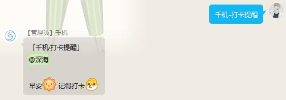
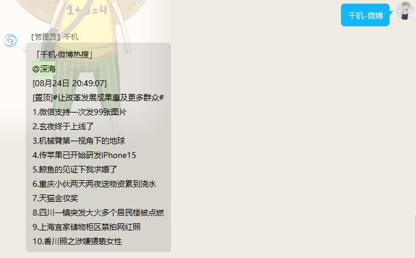

<div align="center">

# SeaBot_QQ


SeaBot_QQ 是一个面向新闻资讯方向的 QQ 群聊机器人，同时包含其他一些实用的小功能

[](https://github.com/B1ue1nWh1te/SeaBot_QQ/blob/main/LICENSE)
[](https://github.com/B1ue1nWh1te/SeaBot_QQ/releases/)
[](https://www.python.org/)
[](https://github.com/nonebot/nonebot2)
[](https://github.com/Mrs4s/go-cqhttp)

</div>

# 前言

项目会保持基本的维护，由于只在自己的班群里使用，所以实现的功能没有花里胡哨，若有不足的地方还请指教。

此项目作为学习交流和个人日常使用。

# 功能列表

- [x] [基础回复](seabot/plugins/basic_reply)(就是机器人昵称被 Call 时进行简单的回复)

- [x] [定时打卡提醒](seabot/plugins/clockin_reminder)(就是健康打卡的提醒，为避免风控吞消息，机器人管理员可主动调用)

- [x] [疫情数据查询](seabot/plugins/epidemic_data_query)(数据来源 网易)

- [x] [Leetcode 每日一题](seabot/plugins/leetcode_everyday)(数据来源 Leetcode)

- [x] [Github 仓库摘要图](seabot/plugins/github_reposity_thumbnail)(数据来源 Github)

- [x] [知乎热榜](seabot/plugins/hot_news)(数据来源 知乎)

- [x] [微博热搜](seabot/plugins/hot_news)(数据来源 微博)

- [x] [央视要闻](seabot/plugins/hot_news)(数据来源 央视新闻)

- [x] [同花顺快讯](seabot/plugins/hot_news)(数据来源 同花顺)

- [x] [历史上的今天](seabot/plugins/today_in_history)(数据来源 百度)

- [x] [天气丨一言](seabot/plugins/weather_saying_card)(数据来源 不明..)

# 部署方法

## 容器化部署

最简便且有效的部署方式，自己只需要调下软件配置就可以把机器人跑起来了。

CentOS 下安装 docker 和 docker-compose:

```shell
# 一键安装docker
curl -fsSL https://get.docker.com | bash -s docker --mirror Aliyun

# 查看docker版本
docker -v

# 设置开机启动
systemctl enable docker

# 启动
systemctl start docker


# 安装docker-compose
pip3 install docker-compose
sudo curl -L "https://github.com/docker/compose/releases/download/v2.2.2/docker-compose-linux-x86_64" -o /usr/local/bin/docker-compose

# 二进制文件应用可执行权限
sudo chmod +x /usr/local/bin/docker-compose

# 创建命令软链接
ln -s /usr/local/bin/docker-compose /usr/bin/docker-compose

# 查看docker-compose版本
docker-compose --version
```

在 Linux 上安装好 docker 和 docker-compose 之后：

```shell
# 克隆本仓库
git clone https://github.com/B1ue1nWh1te/SeaBot_QQ

# 切换至仓库目录
cd SeaBot_QQ
```

按自己的需求修改`seabot/plugins`中各个功能插件的`config.py`中的配置参数（有注释指导）。

之后修改 `./go-cqhttp` 中的 `config.yml` 配置文件，一般情况下，在 `account-uin` 字段中填写机器人的 QQ 号，其他保持默认即可。

然后修改 `./` 中的 `.env.prod` 配置文件，一般情况下，修改 `NICKNAME`、`SUPERUSERS`, 其他保持默认即可。

配置修改完成后，在 `SeaBot_QQ` 目录下打开终端，执行如下命令启动容器服务。

```shell
# 启动容器服务
docker-compose up -d
```

等待应用自动部署即可。

初次使用时，需要在 `go-cqhttp` 端扫码登录机器人账号，可使用如下命令查看日志输出并扫码登录（如果提示异地无法登录则需先在电脑本地运行`go-cqhttp`客户端，扫码登录成功后，将`device.json`和`session.token`文件上传至服务器的`SeaBot_QQ/go-cqhttp`目录）。

```shell
# 查看go-cqhttp容器控制台输出
docker logs -f go-cqhttp

# 查看seabot_qq容器控制台输出
docker logs -f seabot_qq
```

一切顺利的话，很快就可以用上机器人了。

# 文档

如果在使用过程中遇到问题可以提`issue`，或者自行查阅以下官方文档。

- [nonebot2 官方文档](https://v2.nonebot.dev/guide/)

- [go-cqhttp 官方文档](https://docs.go-cqhttp.org/guide/)

# 功能调用示例

图片中的内容是通过 API 获取的信息，仅作功能展示示例。

我们假设机器人昵称为 `千机` 。

> 基础回复 | `千机`


<br>

> 打卡提醒 | `千机-打卡提醒`



<br>

> Github 仓库摘要 | `直接发送仓库链接到群内即可`


<br>

> 知乎热榜 | `千机-知乎`


<br>

> 微博热搜 | `千机-微博`



<br>

> 央视要闻 | `千机-新闻`


<br>

> 同花顺快讯 | `千机-同花顺快讯`


<br>

> 力扣每日一题 | `千机-每日算法`


<br>

> 天气丨一言 | `仅支持定时推送`

<br>

> 疫情数据查询 | `千机-疫情数据 省份-城市`

<br>

> 历史上的今天 | `千机-历史`

# 开源许可

本项目使用 [GPL-3.0](https://choosealicense.com/licenses/gpl-3.0/) 作为开源许可证。
